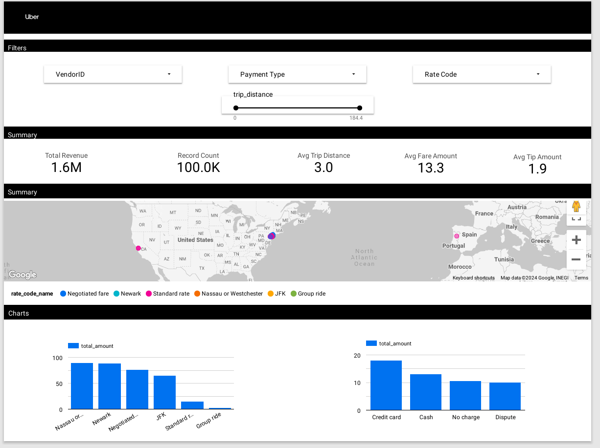

# Uber Data Analytics

## Introduction
Create analytic report from Uber data with modernize data engineering tools  
## Architecture 

## Technology Used

1. Google Storage
2. Compute Instance
3. Mage AI
4. BigQuery
5. Looker Studio

## Dataset Used
https://www.nyc.gov/site/tlc/about/tlc-trip-record-data.page

## Data Model

## Dashboard

https://lookerstudio.google.com/s/hGNRWafdlzQ

## Project idea source
Uber Data Analytics | End-To-End Data Engineering Project By Darshil Parmar\
https://www.youtube.com/watch?v=WpQECq5Hx9g
